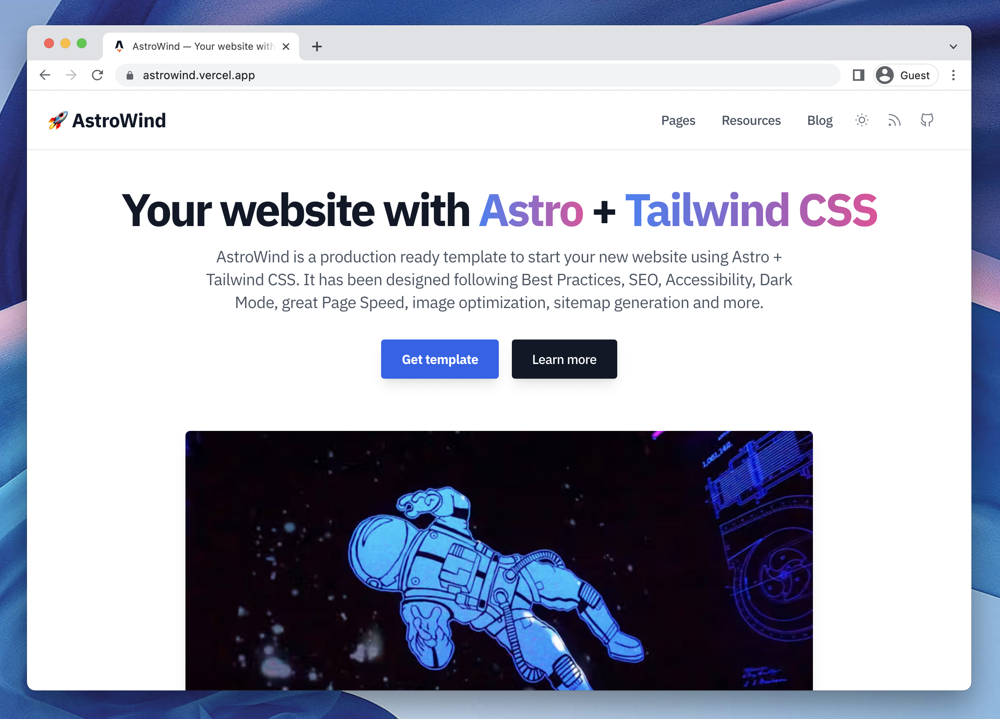

# 🚀 AstroWind


A template to make your website using **Astro + Tailwind CSS**. Ready to start a new project and designed taking into account best practices.

**Features**

- Integration with **Tailwind CSS** via [@astrojs/tailwind](https://docs.astro.build/en/guides/integrations-guide/tailwind/)
- Support for **fast and SEO friendly Blog** with automatic **RSS feed** with [@astrojs/rss](https://docs.astro.build/en/guides/rss/).
- **Image optimization** using [@astrojs/images](https://docs.astro.build/en/guides/integrations-guide/image/).
- Generation of **project sitemap** based on your routes with [@astrojs/sitemap](https://docs.astro.build/en/guides/integrations-guide/sitemap/).
- It supports **Dark mode**
- **Open Graph tags** for social media sharing
- **Fonts optimization** build time with [subfont](https://www.npmjs.com/package/subfont) library.
- **Production-ready** scores in [Lighthouse](https://web.dev/measure/) and [PageSpeed Insights](https://pagespeed.web.dev/) reports

<br>



[Live demo](https://astrowind.vercel.app/) 

<br>

## Project Structure

Inside AstroWind template, you'll see the following folders and files:

```
/
├── public/
│   ├── robots.txt
│   └── favicon.ico
├── src/
│   ├── assets/
│   │   ├── images/
|   |   └── styles/
|   |       └── base.css
│   ├── data/
|   |   └── posts/
|   |       ├── post-slug-1.md
|   |       └── ...
│   ├── components/
│   │   ├── core/
|   |   ├── icons/
|   |   └── widgets/
|   |       ├── Header.astro
|   |       ├── Footer.astro
|   |       └── ...
│   ├── layouts/
│   |   |── BaseLayout.astro
│   |   └── ...
│   ├── pages/
│   |   ├── blog/
|   |   |   ├── [...page].astro
|   |   |   └── [slug].astro
│   |   ├── index.astro
|   |   ├── 404.astro
|   |   └-- rss.xml.js
│   ├── utils/
│   └── config.mjs
├── package.json
└── ...
```

Astro looks for `.astro` or `.md` files in the `src/pages/` directory. Each page is exposed as a route based on its file name.

There's nothing special about `src/components/`, but that's where we like to put any Astro/React/Vue/Svelte/Preact components.

Any static assets, like images, can be placed in the `public/` directory if they do not require any transformation or in the `assets/` directory if they are imported directly.

[](https://githubbox.com/onwidget/astrowind/tree/main)

> 🧑‍🚀 **Seasoned astronaut?** Delete this file. Have fun!

<br>

## Commands

All commands are run from the root of the project, from a terminal:

| Command           | Action                                       |
| :---------------- | :------------------------------------------- |
| `npm install`     | Installs dependencies                        |
| `npm run dev`     | Starts local dev server at `localhost:3000`  |
| `npm run build`   | Build your production site to `./dist/`      |
| `npm run preview` | Preview your build locally, before deploying |

<br>

## Deploy

### Deploy to production (manual)

You can create an optimized production build with:

```shell
npm run build
```

Now, your blog is ready to be deployed. All generated files are located at
`dist` folder, which you can deploy the folder to any hosting service you
prefer.

<br>

### Deploy to Netlify

Clone this repository on own GitHub account and deploy to Netlify:

[](https://app.netlify.com/start/deploy?repository=https://github.com/onwidget/astrowind)

<br>

## Roadmap

- *Config*: Move specific configurations to a specialized file
- *Project structure*: ~~Reduce the complexity in the components folder and simplify the other folders to make it very easy to use.~~ (DONE! Testing)
- *SEO*: ~~Add support to easily manage SEO meta-tags (title, description, canonical, social sharing, ...)~~ (DONE! Testing)
- *Blog*: ~~Add support for fast, accessible, and SEO friendly blog~~ (DONE! Testing)
- *More components*: ~~Add more Tailwind components useful for most scenarios (Features, Contact, Call to Actions, Content, FAQs ...)~~
- *More Examples*: Add commonly used example pages (Ex: About, Terms, Services...)
- *Documentation*: Create detailed documentation with best practices and redesign tips

<br>

## Contributing

If you have any suggestions or find any bugs, feel free to open an issue or create a pull request.

## License

**AstroWind** is licensed under the MIT license — see the [LICENSE](https://github.com/onwidget/astrowind/blob/main/LICENSE) file for details.
