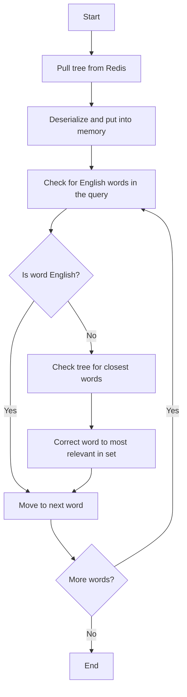

We launched our [Hacker News search and RAG engine](https://hn.trieve.ai) with a half-baked typo correction system. Our first draft took 30+ms which was slow enough that we defaulted it to off. Our latest version is 100 times faster and you can try it at [hn.trieve.ai](https://hn.trieve.ai). Heres the story of how we did it:


## Creating a dictionary of Words and Frequencies

For small datasets, this is an easy task. You can scroll ~1000 HN post size text blobs in 10 seconds with one worker and basic word splitting. However, as you scale to the size of our [Hacker News Demo (38M+ posts)](https://hn.trieve.ai), work needs to be distributed.

Eventually, we decided on 2 distinct workers for dictionary building: 

1. [Cronjob](https://github.com/devflowinc/trieve/blob/main/server/src/bin/word-id-cronjob.rs) to scroll all of the documents present in each of our users' search indices and add chunk ids from our database into a Redis queue 500 at a time.
2. [Word worker](https://github.com/devflowinc/trieve/blob/main/server/src/bin/word-worker.rs) that pops off the queue and procesesses 500 chunks at a time. Text for each chunk is pulled, split into words, and each word is then loaded into Clickhouse.

We chose [ClickHouse](https://clickhouse.com/) to store the dictionary as we ran into deadlock and performance issues with Postgres writes as we scaled the number of workers. ClickHouse's async inserts are fantastic for this task and allowed us to ingest the entire 38M+ document dataset in < 1hr.

## Using a BKTree data structure to identify and correct typos

We take the [standard approach to typo correction](https://nullwords.wordpress.com/2013/03/13/the-bk-tree-a-data-structure-for-spell-checking/) and build per-dataset Burkhard-Keller Trees (BKTrees) for efficient comparision of words in the search query and the dataset's dictionary in O(log N) time complexity. Read more on the data structure at [wikipedia.org/BKTree](https://en.wikipedia.org/wiki/BK-tree).


BKTrees are a type of metric tree whose nodes are the word (and frequency in our case) and edges are the edit distance between the node and its children. 
This type of tree implements a trait known as the triangle inequality.

Let's say we're at a node n in the BKtree, and we know the distance `d(n, q)` between `n` and our query `q`. For any child `c` of `n`, we know `d(n, c)` (it's stored in the tree). The triangle inequality tells us:
`d(q, c) ≥ |d(q, n) - d(n, c)|`. This means if `|d(q, n) - d(n, c)| > k`, we can safely skip the entire subtree rooted at `c`, as no string in that subtree can be within distance `k` of `q`.

We utilized a third[ bktree-worker](https://github.com/devflowinc/trieve/blob/main/server/src/bin/bktree-worker.rs) to build the BKTrees. It takes datasets with completed dictonaries stored in Clickhouse then uses their words and frequencies to construct a tree. 

Once the BKTree is constructed, the worker then stores it in Redis such that it can be efficiently loaded into the API server's memory when needed at first query time for a given dataset.

This was challenging for larger datasets where the tree was hundreds of megabytes large and timed out redis on write and read. We developed a [serialization method](https://github.com/devflowinc/trieve/blob/6e114abdca5683440e2834eccacf3f850dff810f/server/src/operators/typo_operator.rs#L40-112) which flattens and gzips to reduce the size in redis as well as the latency when pulling and pushing from it.

## Writing the Business Logic to Perform Typo Corrections

On the API server side, in our [typo_operator](https://github.com/devflowinc/trieve/blob/main/server/src/operators/typo_operator.rs), we optimized to reduce time required for corrections down to ~300μs for correctly spelled queries and ~25ms for mispelled queries.



### Pulling from Redis

Pulling a massive data structure, like the BKTree for HN, from Redis takes 300+μs. This is **nonviable** to do on each search, so we developed a cache layer server-side to store BKTrees after they had been pulled once using `lazy_static!`

```rust=
lazy_static! {
    static ref BKTREE_CACHE: BKTreeCache = BKTreeCache::new();
}
```

On the first search with typo-tolerance enabled, we initiate a ~200-400ms cold start to pull the BKTree for the dataset being queried from Redis into server memory. Searches following this operation then use the BKTree to check for typos which only takes 100-300μs. 

### Identifying English Words

#### 1. Preliminary English Word Identification

Since our BKTrees are constructed solely from dataset-specific dictionaries, they may not have all valid English words. To prevent inaccurate corrections of legitimate words absent from our trees, we use a preliminary English word identification step:

- We maintain an in-memory hashset of approximately 400,000 English words, stored using `lazy_static!`.

```rust=
static ref ENGLISH_WORDS: HashSet<String> = {
        include_str!("../words.txt")
            .lines()
            .map(|s| s.to_lowercase())
            .collect()
    };
```

#### 2. Affix Analysis

We then check for if the word is just an english word with a prefix or suffix: 

- We construct separate Tries for common prefixes and suffixes.

```rust=
static ref PREFIX_TRIE: Trie = {
        let prefixes = vec![
            "anti", "auto", "de", "dis", "down", "extra", "hyper", "il", "im", "in", "ir", "inter",
            "mega", "mid", "mis", "non", "over", "out", "post", "pre", "pro", "re", "semi", "sub",
            "super", "tele", "trans", "ultra", "un", "under", "up",
        ];
        Trie::new(&prefixes)
    };
    static ref SUFFIX_TRIE: Trie = {
        let suffixes = vec![
            "able", "al", "ance", "ation", "ative", "ed", "en", "ence", "ent", "er", "es", "est",
            "ful", "ian", "ible", "ic", "ing", "ion", "ious", "ise", "ish", "ism", "ist", "ity",
            "ive", "ize", "less", "ly", "ment", "ness", "or", "ous", "s", "sion", "tion", "ty",
            "y",
        ];
        Trie::new(&suffixes)
    };
```

1. For each word in the query, we search these Tries to identify the longest matching prefix and suffix.
2. We then strip these affixes from the word, leaving us with the root.
3. After stripping, we perform a final dictionary check:
4. The stripped root is searched against the english word corpus.

```rust=
fn is_likely_english_word(word: &str) -> bool {
    if ENGLISH_WORDS.contains(&word.to_lowercase()) {
        return true;
    }

    // Check for prefix
    if let Some(prefix_len) = PREFIX_TRIE.longest_prefix(word) {
        if ENGLISH_WORDS.contains(&word[prefix_len..].to_lowercase()) {
            return true;
        }
    }

    // Check for suffix
    if let Some(suffix_len) = SUFFIX_TRIE.longest_suffix(word) {
        if ENGLISH_WORDS.contains(&word[..word.len() - suffix_len].to_lowercase()) {
            return true;
        }
    }

    // Check for compound words
    if word.contains('-') {
        let parts: Vec<&str> = word.split('-').collect();
        if parts
            .iter()
            .all(|part| ENGLISH_WORDS.contains(&part.to_lowercase()))
        {
            return true;
        }
    }

    false
}
```

#### 4. BKTree Search for Non-Dictionary Words

For words that don't pass our English word checks, we initiate a BKTree search:

1. Query the BKTree to find the closest matching words.
2. Generate a set of candidate corrections for each non-dictionary word.

```rust=
let mut best_correction = None;
            let mut best_score = 0;

            for ((correction, freq), distance) in tree.find(word.to_string(), max_distance) {
                if distance == 0 {
                    best_correction = None;
                    break;
                }
                if !is_best_correction(word, correction) {
                    continue;
                }

                let score = (max_distance - distance) * 1000 + *freq as isize;

                if score > best_score || best_correction.is_none() {
                    best_correction = Some(correction);
                    best_score = score;
                }
            }

            if let Some(correction) = best_correction {
                corrections.insert(word, correction.to_string());
            }
```

#### 5. Correction Selection

From the set of correction candidates, we use a scoring algorithm to select the best correction:

Our algorithm prioritizes prefix matches and factors in the frequency of each candidate word within the dataset.

```rust=
fn is_best_correction(word: &str, correction: &str) -> bool {
    // Length-based filter
    let len_diff = (word.len() as i32 - correction.len() as i32).abs();
    if len_diff > 2 {
        return false;
    }

    // Prefix matching (adjust the length as needed)
    let prefix_len = std::cmp::min(1, std::cmp::min(word.len(), correction.len()));
    if word[..prefix_len] != correction[..prefix_len] {
        return false;
    }

    // Character set comparison
    let word_chars: HashSet<char> = word.chars().collect();
    let correction_chars: HashSet<char> = correction.chars().collect();
    let common_chars = word_chars.intersection(&correction_chars).count();
    let similarity_ratio =
        common_chars as f32 / word_chars.len().max(correction_chars.len()) as f32;

    similarity_ratio >= 0.8
}
```

## Unexpected Benefits

[Levitating commented on HN](https://news.ycombinator.com/item?id=41396655) that a query for `FreeBSD` sorted by points returned irrelevant results. Our tokenizer splits on camel case so `FreeBSD` got turned into `Free BSD FreeBSD` and stories only containing the word "Free" had more points than anything containing "FreeBSD" and thus ranked higher. Being able to effectively check for full words on a dataset-level allowed us to automatically require non-English words such that a query for `FreeBSD` turned into `"FreeBSD"`.


## Future Ideas

We plan to leverage this same system to implement query splitting and concatenation as those features share the same requirement of quickly looking up words in a dictionary as does typo tolerance.

Trieve will always pursue the best possible relevance out of the box! Try it on our [HN search engine](https://hn.trieve.ai), [sign up for a free cloud account](https://dashboard.trieve.ai), or [see our self-hosting guides](https://docs.trieve.ai/self-hosting/aws).
