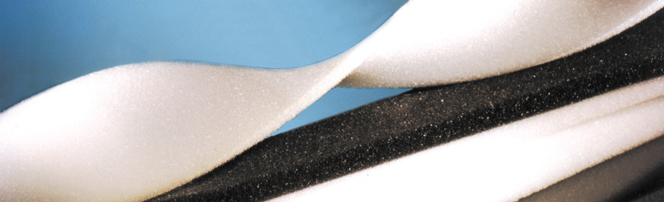

import DListItem from '~/components/ui/DListItem.astro';
import ToggleTheme from '~/components/common/ToggleTheme.astro';
import { Youtube } from 'astro-embed';

### Polyurethane Foam punya banyak sekali varian. Mulai dari flexible foam, sampai memory foam.

Kali ini kita akan membahas jenis, karakter, dan juga fungsi utama dari berbagai jenis busa ini.

### 1. Flexible (Fleksibel) Foam

Jenis busa yang paling umum ditemukan di pasaran. Sesuai dengan namanya, flexible foam adalah busa yang lentur dan dapat ditekuk.

Busa jenis ini biasanya digunakan untuk kasur, furniture, dan juga packaging. Karena sifatnya yang lentur, busa ini bisa mengembang kembali setelah divakum.

Namun kecepatan pengembangan kembali ditentukan dari kualitas busa yang diproduksi oleh pabrikannya.

### 2. Molded Foam (Busa Jok Motor)

Pabrikan jok motor paling sering menggunakan busa molded, karena memang penggunaan yang paling umum adalah di industri jok motor.

Sebenarnya segala jok mobil dan motor pasti menggunakan busa molded. Beberapa kursi kantor dan hampir seluruh kursi bioskop juga menggunakan busa jenis ini.

Cara produksi molded foam ini termasuk mudah, hanya perlu mencampurkan kimia A dan B (polyol dan isocyanate) yang kemudian dituang ke dalam wadah.

### 3. Latex Foam (Busa Latex)

Latex foam atau latex sintetis adalah jenis foam yang mirip dengan molded foam dan HR foam, walaupun ada perbedaan sedikit di bahan baku yang membuatnya sedikit berbeda.

Latex foam diciptakan sebagai pengganti natural latex atau latex alami. Jawaban untuk matras natural latex yang harganya terus melambung.

Bisa dibilang latex sintetis ini menjawab berbagai masalah yang ada di natural latex.

Harga terjangkau, tidak berbau, dan tidak menarik organisme.

Iya, latex alami sudah terkenal dapat menarik organisme dan menarik kutu untuk berkembang biak.

Namun harganya memang masih tinggi dibandingkan dengan flexible foam, maka itu Latex Foam lebih sering dipakai dalam bentuk lembaran tipis sebagai pelapis atas dari matras.

Memberikan kenyamanan extra dan harga yang sangat terjangkau.

### 4. Memory Foam / Visco Elastic Foam (Busa Memori)

Memory Foam disebut sebagai teknologi termutakhir dari industri polyurethane foam. Padahal riset dan penemuan busa memori ini dilakukan pada tahun 1960an, sudah cukup tua bukan?

Awal diciptakan untuk kursi para astronot NASA, memory foam unggul dalam distribusi berat badan sehingga dipercaya dapat menopang beban tubuh agar tidak mengalami masalah postur saat tidur.

Sayangnya memory foam ini termasuk mahal dan tidak tahan lama. Karena busa memori akan kehilangan kemampuan untuk menyesuaikan dengan berat badan seiring dengan waktu.

Belum lagi memory foam termasuk panas saat digunakan, padahal sudah menggunakan AC saat tidur. Sehingga memory foam lebih banyak ditemukan digunakan pada bantal kepala dibandingkan matras/kasur tidur.

### 5. High Resiliency Foam (Busa HR)

Produksi polyurethane foam pada umumnya adalah menggunakan hot process.

Sedangkan HR Foam menggunakan cold process, dan sangat berbeda karakternya dengan polyurethane foam pada umumnya.

Untuk karakter busanya sendiri mirip dengan Molded Foam, namun karena curing yang dipakai adalah cold process, busa-nya lebih berbau.

Ini terjadi karena senyawa kimia yang menyebabkan bau masih terjebak di dalam busa. Sehingga biasanya untuk membantu proses curing, busa sering diberi tekanan yang kuat dan berulang kali agar gas-gas cepat hilang.

Salah satu pembuktian juga bahwa busa HR Foam sudah dijamin durable, sangat kuat dan tahan lama.

### 6. Rebonded Foam (Busa Rebondit)

Rebonded foam sebenarnya adalah proses daur ulang dari limbah-limbah busa flexible foam kualitas super.

Sisa-sisa potongan dari flexible foam digiling menjadi hancuran-hancuran kecil, kemudian ditempel ulang dengan campuran kimiawi dan diberi panas supaya bisa lengket.

Karena ini busa rebondit mempunyai tingkat kekerasan yang tinggi.

Cuma kekurangan dari busa rebondit ini adalah kekerasannya. Tidak semua orang cocok dengan busa rebondit. Penggunaan rebonded foam juga hanya untuk beberapa situasi khusus karena kurang nyaman.

Sehingga rebonded foam ini biasa digunakan lembaran tipis sebagai salah satu lapisan saja.

### What's Next?

https://www.youtube.com/watch?v=cW3tzRzTHKI

Teknologi polyurethane masih terus berkembang walaupun lambat. Industri polyurethane sedang gencar mendukung gerakan Go Green.

Ini dapat dilakukan dengan menggunakan bahan baku yang sesuai dengan inisiatif tersebut. Seperti menggunakan by-product dari produksi Polyol untuk didaur ulang kembali.

Beberapa peneliti juga sedang mencari tahu bagaimana mendaur ulang kasur-kasur bekas pakai yang sudah usang, karena kasur usang tidak bisa dipakai lagi untuk rebonded.

Banyak masalah lingkungan yang diciptakan oleh industri plastik dan polymer sehingga para peneliti bekerja dengan keras untuk bisa menyelamatkan planet Bumi ini sambil tetap dapat menghasilkan produk yang nyaman.

Semoga artikel pendek ini dapat membantu kalian dalam memilih busa yang tepat untuk kebutuhan kalian ya!

---

### MS Foam
Pabrik busa yang memproduksi busa dalam ukuran standar maupun custom. Hubungi kami di 0215580197, 0881082916666, ms.foam@gmail.com untuk meminta sample.