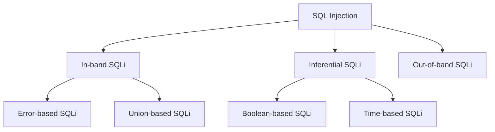

---

# SQLMap Cheatsheet: Automated SQL Injection Testing and Interview Questions
```bash
- sqlmap 
    - sqlmap -u <url> 
    - sqlmap -u <url> --dbs 
    - sqlmap -u <url> --tables -D <db> 
    - sqlmap -u <url> --columns -D <db> -T <table> 
    - sqlmap -u <url> --dump -D <db> -T <table> 
    - sqlmap.py -u <url> --method POST --data <data> -p <field_to_attack> 
    - sqlmap -u "<url>*" 
    - sqlmap -u <url> --random-agent 
```

Question : if there blind SQl Injection and we are able to use bling command what kind of database is being used. 

# SQL Injection: Understanding the Vulnerability 

## What is SQL Injection? 

SQL Injection is a code injection technique that exploits vulnerabilities in the data-driven applications where malicious SQL statements are inserted into application queries to manipulate the database. 

## How SQL Injection Happens 

SQL Injection occurs when user-supplied data is not properly validated, filtered, or sanitized by web applications. This allows attackers to modify an applications SQL queries, potentially letting them: 

1. Bypass authentication 
2. Retrieve sensitive information 
3. Modify database contents 
4. Execute administration operations on the database 

## Why SQL Injection Happens 

SQL Injection vulnerabilities typically arise due to: 
```
-> Lack of input validation 
-> Improper use of parameterized queries 
-> Insufficient error handling 
-> Over-privileged database accounts 
```
## SQL Injection Prevention 

To prevent SQL Injection attacks: 
```
-> Use parameterized queries 
-> Implement input validation and sanitization 
-> Employ the principle of least privilege for database accounts 
-> Use stored procedures 
-> Keep software and systems updated 
```
## Popular SQL Injection Interview Questions 


    1. What is the difference between first-order and second-order SQL Injection? 
        
        First-order: The injected SQL executes immediately. 
        Second-order: The payload is stored in the database and executed later when retrieved. 
        
 
    2. How can you detect SQL Injection vulnerabilities? 
    ```
        -> Manual testing with crafted inputs 
        -> Automated scanning tools (e.g., sqlmap) 
        -> Code review 
        -> Penetration testing 
    ```
 
    3. What is blind SQL Injection? 
        
        Blind SQL Injection occurs when an application is vulnerable to SQL Injection, but its HTTP responses dont contain the results of the relevant SQL query or the details of database errors. 
        

## SQL Injection Attack Types 



## Conclusion 

SQL Injection remains a critical vulnerability in web applications. Understanding its mechanisms, prevention techniques, and impact is crucial for developers and security professionals alike. Regular security audits, proper coding practices, and staying informed about the latest attack vectors are essential in mitigating this persistent threat.
